# TaskFlow API — Complete Backend Engineering Reference

> A from-scratch journey into backend development with NestJS + TypeScript, built by a mobile developer learning backend the practical way: by building a real, production-shaped application.

---

## How To Use This Document

This is not a generic NestJS tutorial. Every code sample here is the **actual code** built during this learning journey — including the real mistakes made, the real bugs hit, and the real fixes applied. Where something was wrong and later corrected, that's documented too, because debugging real errors is part of the learning.

```
Reading order:   Top to bottom, first time through
Reference order: Jump to any Part using the Table of Contents
Diagrams:        Written in Mermaid syntax — render natively in
                 GitHub, VS Code (with Mermaid extension), Obsidian,
                 or any Markdown viewer with Mermaid support
```

**Conventions used throughout:**
```
✅  Correct / recommended approach
❌  Incorrect / what NOT to do (shown for contrast)
⚠️  Warning — works, but with a caveat
📌  Key concept worth memorizing
🐛  A real bug we hit during this project, and the fix
```

---

## Table of Contents

**Part I — Foundations**
- 0.1 What Is a Backend? (Mental Model for Mobile Developers)
- 0.2 How The Internet Works (HTTP & REST)
- 0.3 What Is NestJS and Why It Exists

**Part II — NestJS Core**
- 1.1 Building Blocks + First Project Setup
- 1.2 Modules
- 1.3 Controllers
- 1.4 Error Handling & HTTP Exceptions
- 1.5 Services & Dependency Injection

**Part III — The Request Lifecycle**
- 2.1 Middleware
- 2.2 Guards
- 2.3 Interceptors
- 2.4 Pipes & Validation
- 2.5 Exception Filters
- 2.6 The Complete Lifecycle (Master Diagram)

*(Part IV — Database, Part V — Validation Deep Dive, Part VI — Authentication & RBAC, and Appendices are in separate companion documents — see the end of this file for links.)*

---

# Part I — Foundations

## 0.1 — What Is a Backend?
### *Explained for a Mobile Developer*

### The Restaurant Analogy

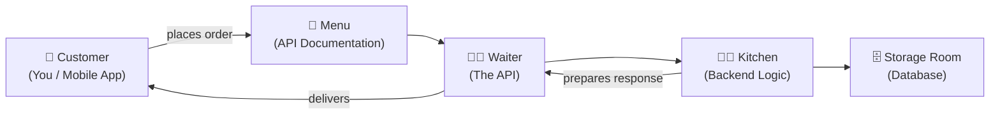

The customer never enters the kitchen. The kitchen never talks to the customer directly. **That separation is the entire point of a backend.**

### The 3 Core Responsibilities of Any Backend

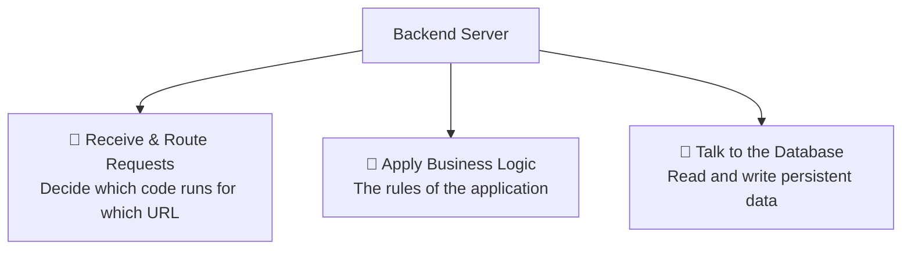

📌 **Key principle:** On the backend, you trust nothing that comes in. You validate everything. You authorize every action.

### Backend vs Frontend — The Mindset Shift

| | Mobile / Frontend | Backend |
|---|---|---|
| Runs on | User's device | Server (always on) |
| Thinks about | UI, UX, State | Data, Rules, Security |
| Trusts input? | Yes (it's the user) | **Never** |
| Concurrent users | One at a time | Thousands at once |
| If it crashes | One user affected | Everyone affected |

---

## 0.2 — How The Internet Works
### *HTTP, Request & Response*

### Anatomy of an HTTP Request

```
https://api.taskflow.com/projects/5/tasks?status=open

│        │                │         │      │
│        │                │         │      └── Query Params
│        │                │         └───────── Resource ID
│        │                └─────────────────── Path / Route
│        └──────────────────────────────────── Domain
└───────────────────────────────────────────── Protocol
```

### HTTP Methods

```
GET     → Read / Fetch data
POST    → Create something new
PUT     → Replace entirely
PATCH   → Update partially
DELETE  → Remove something
```

### Status Codes

```
2xx → Success
  200  OK              General success
  201  Created          POST success
  204  No Content       Success, nothing to return (DELETE)

4xx → Client Error (their fault)
  400  Bad Request      Invalid data sent
  401  Unauthorized     Not logged in
  403  Forbidden        Logged in, but no permission
  404  Not Found        Resource doesn't exist
  409  Conflict         Duplicate / already exists

5xx → Server Error (our fault)
  500  Internal Server Error
```

📌 **Critical distinction, memorize this:**
```
401 → "I don't know WHO you are"        (not authenticated)
403 → "I know who you are, but you      (authenticated, but
       can't do THIS"                    not authorized)
```

### REST — The Rules We Follow

**REST = Representational State Transfer.** It's a set of conventions: **URLs are nouns, HTTP methods are verbs.**

```
✅ Good REST design:
GET    /projects           get all projects
GET    /projects/5         get project #5
POST   /projects           create a project
PATCH  /projects/5         update project #5
DELETE /projects/5         delete project #5
GET    /projects/5/tasks   get tasks of project #5

❌ Bad REST design:
GET    /getProjects
POST   /createNewProject
GET    /deleteProject?id=5
```

### The Request Journey

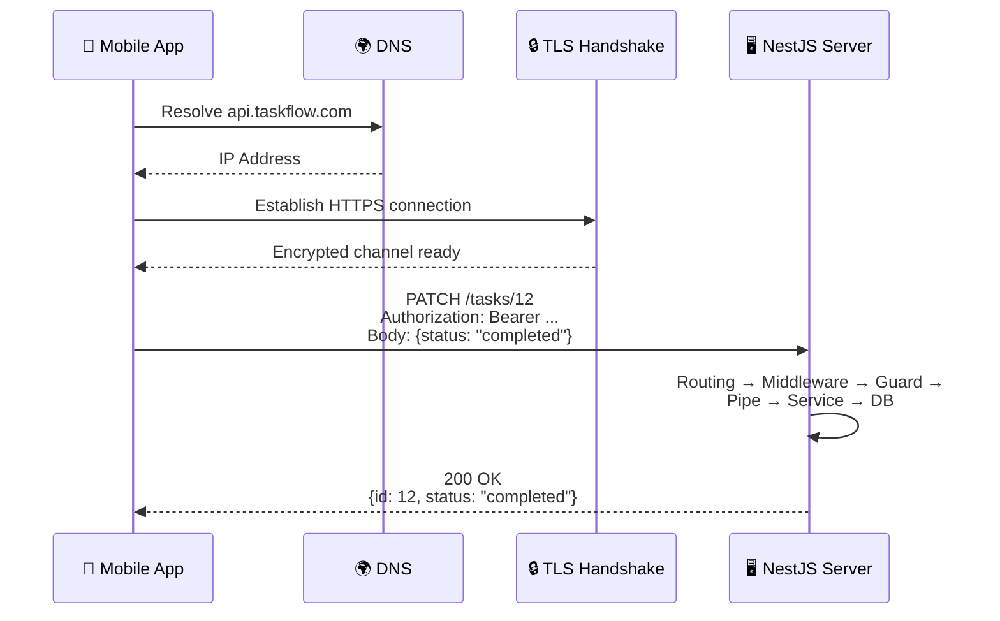

### TaskFlow's Full API Surface

```
AUTH
POST   /auth/register
POST   /auth/login
POST   /auth/refresh

USERS
GET    /users
GET    /users/:id
POST   /users
PATCH  /users/:id
DELETE /users/:id

PROJECTS
GET    /projects
POST   /projects
GET    /projects/:id
PATCH  /projects/:id
DELETE /projects/:id          (admin only — RBAC, see Part VI)

TASKS
GET    /projects/:id/tasks
POST   /projects/:id/tasks
PATCH  /tasks/:id
DELETE /tasks/:id             (admin only — RBAC, see Part VI)
```

---

## 0.3 — What Is NestJS and Why It Exists

### The Stack

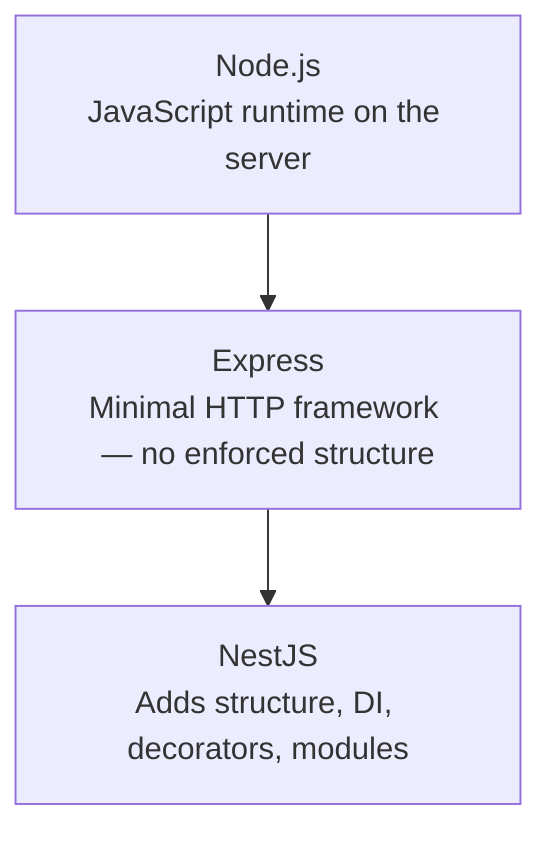

NestJS doesn't replace Express — **it organizes it.** It brings the same kind of opinionated, structured approach that Angular brought to frontend development.

### What Makes NestJS Different

```
1. Enforced structure       — every NestJS app looks the same
2. Dependency Injection     — NestJS manages object creation for you
3. Decorator-based code     — reads almost like documentation
4. Modular architecture     — each feature is self-contained
5. TypeScript-first         — full type safety throughout
```

### NestJS vs Alternatives

| | NestJS | Express | Fastify |
|---|---|---|---|
| Structure | ✅ Strong | ❌ None | ❌ Minimal |
| TypeScript | ✅ Native | ⚠️ Add-on | ⚠️ Add-on |
| DI System | ✅ Built-in | ❌ Manual | ❌ Manual |
| Learning curve | ⚠️ Medium | ✅ Easy | ✅ Easy |
| Production scale | ✅ Great | ⚠️ Effort needed | ⚠️ Effort needed |

### The Angular Connection

If you've seen Angular, NestJS feels familiar:

```
Angular Component              NestJS Controller
──────────────────────────────────────────────────
@Component({...})              @Controller('users')
export class UsersComponent {  export class UsersController {
  constructor(                   constructor(
    private userService          private usersService: UsersService
  ) {}                          ) {}

  getUsers() {                   @Get()
    this.userService.getAll()    findAll() {
  }                                 return this.usersService.findAll()
}                                 }
                                }
```

### ORM Choice — TypeORM vs Prisma vs Sequelize

A real decision point worth documenting: NestJS officially supports multiple ORMs. We chose **TypeORM**.

| | TypeORM | Prisma | Sequelize |
|---|---|---|---|
| TypeScript | ✅ Native | ✅ Great (generated client) | ⚠️ Added later |
| NestJS fit | ✅ Best — decorator pattern matches everything else | ✅ Good, but separate schema language | ✅ Good, official support |
| Learning curve | Medium | Easy | Hard |
| Schema definition | Decorators on classes (code-first) | Separate `.prisma` schema file | Decorators (code-first) |
| Job market (2026) | ✅ Most common in NestJS roles | ✅ Rapidly growing | ⚠️ Declining |

**Why TypeORM for this project:** Decorators (`@Entity()`, `@Column()`) follow the exact same pattern as everything else in NestJS (`@Controller()`, `@Injectable()`). This consistency made it the right choice for *learning* the framework deeply. Prisma is a genuinely strong choice for production today — but understanding TypeORM's lower-level patterns (Repository, QueryRunner, manual transactions) builds a deeper foundation that transfers to any ORM.

---

# Part II — NestJS Core

## 1.1 — Building Blocks + Project Setup

### The 4 Core Building Blocks

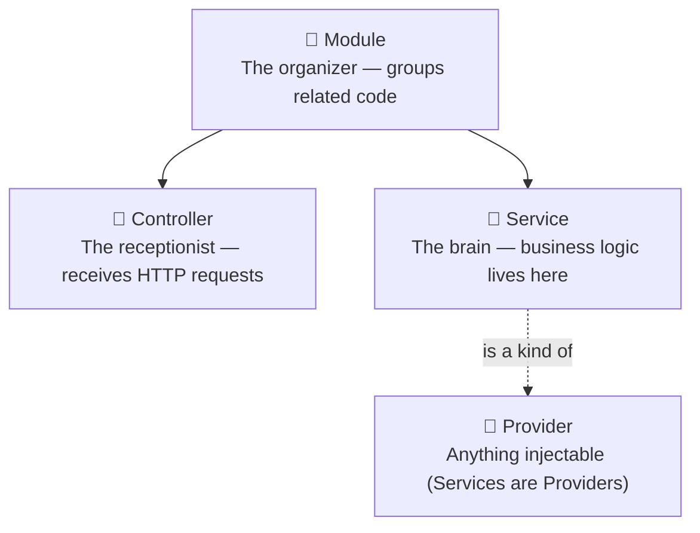

```
Module      → groups a feature's controller(s) + service(s)
Controller  → receives requests, delegates to service, returns response
              CONTAINS NO BUSINESS LOGIC
Service     → contains all business logic; controllers call it
Provider    → the umbrella term — anything NestJS can inject
              (services, repositories, custom providers)
```

### How a Request Flows Through These Blocks

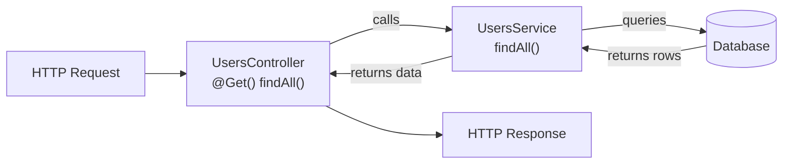

### Project Bootstrap

```bash
npm install -g @nestjs/cli
nest new taskflow-api
cd taskflow-api
```

`main.ts` — the entry point (equivalent to `runApp()` in Flutter):

```typescript
import { NestFactory } from '@nestjs/core';
import { AppModule } from './app.module';

async function bootstrap() {
  const app = await NestFactory.create(AppModule);
  await app.listen(3000);
}
bootstrap();
```

### Production Folder Structure (used from Chapter 1 onward)

```
src/
├── common/                  → Shared across all modules
│   ├── decorators/          → @Public(), @Roles(), @CurrentUser()
│   ├── filters/             → GlobalExceptionFilter
│   ├── guards/               → AuthGuard, RolesGuard
│   ├── interceptors/        → LoggingInterceptor, ResponseTransformInterceptor
│   ├── middleware/          → LoggerMiddleware
│   ├── types/                → express.d.ts (type augmentation)
│   └── validators/          → custom class-validator decorators
│
├── config/                  → database.config.ts (used by TypeORM CLI)
│
├── modules/                 → Feature modules
│   ├── auth/
│   ├── users/
│   ├── projects/
│   └── tasks/
│
├── app.module.ts            → Root module
└── main.ts                  → Entry point
```

📌 Each feature module (`modules/users/`, etc.) internally follows:
```
modules/users/
├── dto/                     → CreateUserDto, UpdateUserDto, CreateUserData
├── entities/                → user.entity.ts
├── users.controller.ts
├── users.service.ts
└── users.module.ts
```

---

## 1.2 — Modules

### The 4 Module Properties

```typescript
@Module({
  imports: [],        // Other modules this module depends on
  controllers: [],     // Controllers this module owns
  providers: [],       // Services/providers this module owns
  exports: [],          // What this module shares with importers
})
```

📌 **Critical rule:** Providers are private to their module by default. If you don't `export` it, no other module can inject it — even if they `import` your module.

### TaskFlow's Module Graph

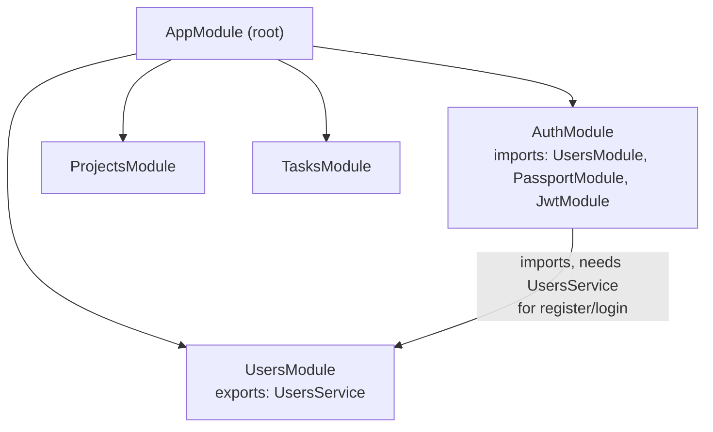

### Generating Modules (always via CLI)

```bash
nest g mo modules/users --no-spec
nest g co modules/users --no-spec
nest g s modules/users --no-spec
```

The CLI automatically wires the controller and service into the module's `@Module()` decorator, and the module into `AppModule`. Never wire these by hand.

---

## 1.3 — Controllers

### One Job Only: Receive, Delegate, Respond

```typescript
// ❌ WRONG — business logic in controller
@Get(':id')
async findOne(@Param('id') id: string) {
  const user = await this.db.query(`SELECT * FROM users WHERE id = ${id}`)
  if (!user) throw new Error('not found')
  return user
}

// ✅ RIGHT — controller just delegates
@Get(':id')
findOne(@Param('id') id: string) {
  return this.usersService.findOne(id)
}
```

### Controller & Parameter Decorators Used In This Project

```typescript
@Controller('users')          // base path → /users
export class UsersController {

  @Get()                      // GET    /users
  @Post()                     // POST   /users
  @Patch(':id')               // PATCH  /users/:id
  @Delete(':id')              // DELETE /users/:id

  @Param('id')                // URL param
  @Query('status')            // Query string param
  @Body()                     // Full request body (typed via DTO)
  @HttpCode(204)              // Override default status code
}
```

### Final `users.controller.ts` (as built)

```typescript
import {
  Body, Controller, Delete, Get, HttpCode,
  Param, ParseIntPipe, Patch, Post,
} from '@nestjs/common';
import { UsersService } from './users.service';
import { CreateUserDto } from './dto/create-user.dto';
import { UpdateUserDto } from './dto/update-user.dto';

@Controller('users')
export class UsersController {
  constructor(private readonly usersService: UsersService) {}

  @Get()
  findAll() {
    return this.usersService.findAll();
  }

  @Get(':id')
  findOne(@Param('id', ParseIntPipe) id: number) {
    return this.usersService.findOne(id);
  }

  @Post()
  create(@Body() createUserDto: CreateUserDto) {
    return this.usersService.create(createUserDto);
  }

  @Patch(':id')
  update(
    @Param('id', ParseIntPipe) id: number,
    @Body() updateUserDto: UpdateUserDto,
  ) {
    return this.usersService.update(id, updateUserDto);
  }

  @Delete(':id')
  @HttpCode(204)
  remove(@Param('id', ParseIntPipe) id: number) {
    this.usersService.remove(id);
  }
}
```

⚠️ **Style inconsistency note:** the `remove()` method above is missing `return` before `this.usersService.remove(id)`. It still works (204 doesn't need a body), but `projects.controller.ts` and `tasks.controller.ts` both correctly use `return` in their equivalent methods. Worth fixing for consistency — see Appendix A.

### `ParseIntPipe` — Why It's Everywhere

```typescript
@Param('id', ParseIntPipe) id: number
```

URL params always arrive as strings (`/users/1` → `"1"`). `ParseIntPipe` converts to a real number and automatically throws `400 Bad Request` if the value isn't numeric (e.g., `/users/abc`).

---

## 1.4 — Error Handling & HTTP Exceptions

### Why Returning `200` With Empty Data Is Wrong

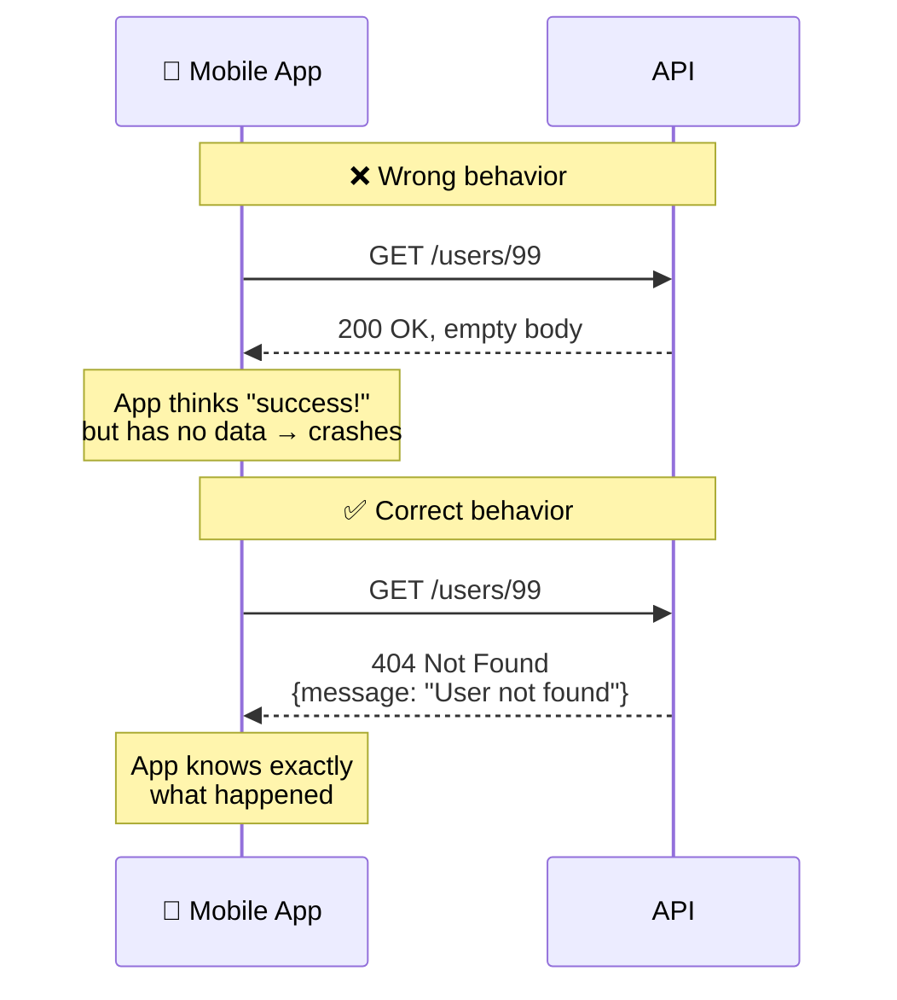

### Throw, Don't Return

```typescript
// ❌ Mobile-dev instinct — returning error states
findOne(id: string) {
  const user = this.users.find(u => u.id === id)
  if (!user) return { error: 'not found' }
  return user
}

// ✅ NestJS way — throwing exceptions
findOne(id: string) {
  const user = this.users.find(u => u.id === id)
  if (!user) throw new NotFoundException(`User with id ${id} not found`)
  return user
}
```

NestJS's built-in exception classes map directly to status codes:

```
NotFoundException       → 404
BadRequestException     → 400
UnauthorizedException   → 401
ForbiddenException      → 403
ConflictException       → 409
InternalServerErrorException → 500
```

📌 **Rule: throw exceptions in the Service, not the Controller.** Error handling is business logic, and it should travel with the logic that produces it.

---

## 1.5 — Services & Dependency Injection

### The Problem DI Solves

```typescript
// ❌ Without DI — manual wiring, tight coupling
class TasksController {
  private tasksService: TasksService
  constructor() {
    const usersService = new UsersService()
    const projectsService = new ProjectsService(usersService)
    this.tasksService = new TasksService(usersService, projectsService)
  }
}
```

```typescript
// ✅ With DI — just declare what you need
@Controller('tasks')
export class TasksController {
  constructor(private readonly tasksService: TasksService) {}
}
```

### How DI Works — Step by Step

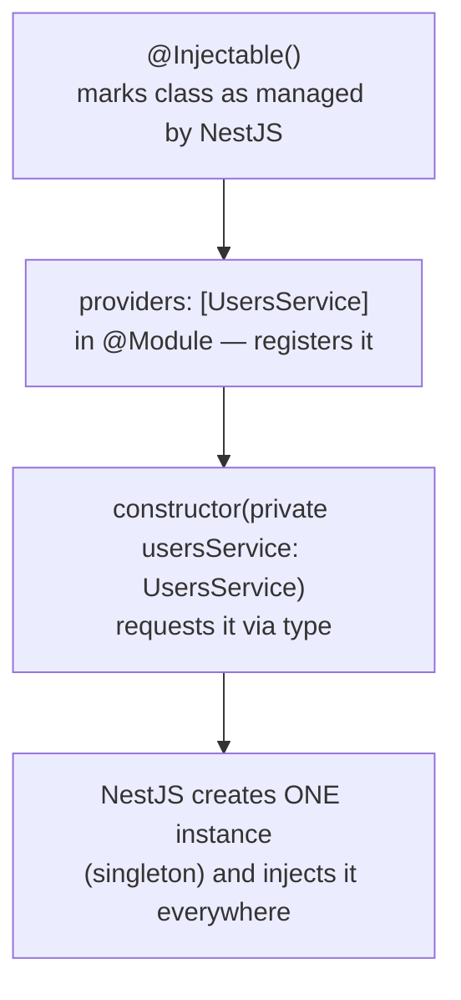

📌 **Singleton behavior:** NestJS creates each provider exactly once and reuses that same instance everywhere it's injected. `UsersService` injected into `UsersController` and into `AuthService` is the *same object* in memory.

### Sharing a Service Across Modules

```typescript
// users.module.ts — must EXPORT to share
@Module({
  providers: [UsersService],
  exports: [UsersService],   // ← required for AuthModule to use it
})
export class UsersModule {}

// auth.module.ts — must IMPORT to use it
@Module({
  imports: [UsersModule],    // ← brings in UsersService
})
export class AuthModule {}
```

🐛 **Common error if you forget `exports`:**
```
Nest can't resolve dependencies of AuthService.
Please make sure that UsersService is available
in the current module context.
```
First thing to check when you see this: did you export the service from its own module?

---

# Part III — The Request Lifecycle

## Overview — Where We're Going

Every request passes through five distinct layers, in a fixed order, before it reaches your controller — and the same layers handle the response (and any errors) on the way back out.

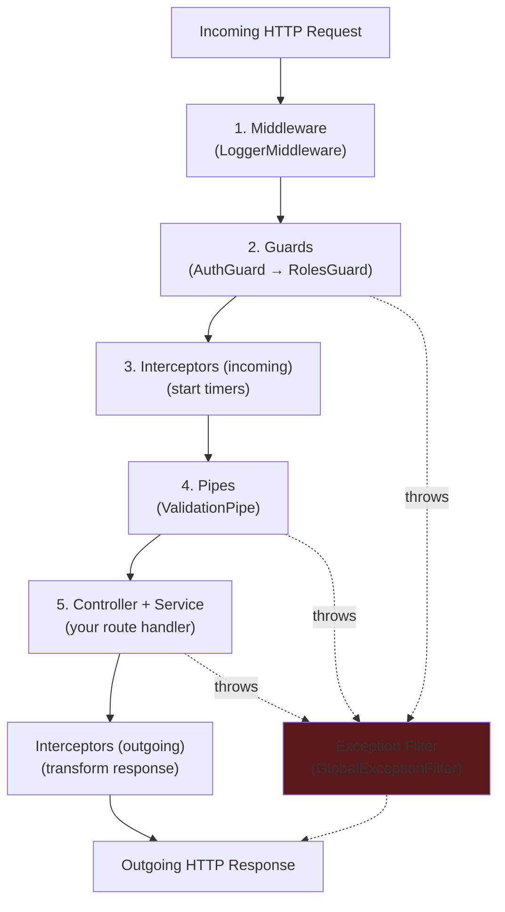

📌 **Why this order:** early layers handle broad concerns (applies to everything), later layers handle specific concerns (applies to one route).

```
Middleware    → runs before NestJS even knows the route
Guards        → runs after routing; decides allow/block
Interceptors  → wraps the entire request/response cycle
Pipes         → validates/transforms data just before the handler
Filters       → the safety net; catches anything thrown anywhere
```

---

## 2.1 — Middleware

Runs **before** routing — doesn't know which controller will handle the request. Used for broad, universal concerns: logging, request IDs, cookie parsing.

### `LoggerMiddleware` (as built)

```typescript
import { Injectable, NestMiddleware } from '@nestjs/common';
import { Request, Response, NextFunction } from 'express';

@Injectable()
export class LoggerMiddleware implements NestMiddleware {
  use(req: Request, res: Response, next: NextFunction): void {
    const { method, originalUrl } = req;
    const start = Date.now();

    res.on('finish', () => {
      const { statusCode } = res;
      const duration = Date.now() - start;
      console.log(
        `[${new Date().toISOString()}] ${method} ${originalUrl} → ${statusCode} (${duration}ms)`,
      );
    });

    next(); // ⚠️ MUST call next() or the request hangs forever
  }
}
```

### Registration (different pattern from everything else)

```typescript
// app.module.ts
export class AppModule implements NestModule {
  configure(consumer: MiddlewareConsumer) {
    consumer.apply(LoggerMiddleware).forRoutes('*');
  }
}
```

📌 Middleware is **not** registered in the `@Module()` decorator's `providers` array — it uses the `configure()` method via `NestModule` interface instead.

---

## 2.2 — Guards

Run **after** routing — they know exactly which controller/handler will be called. Return `true` to continue, `false` or throw to block.

### Decorators — Tagging Routes With Metadata

```typescript
// public.decorator.ts
import { SetMetadata } from '@nestjs/common';

export const IS_PUBLIC_KEY = 'isPublic';
export const Public = () => SetMetadata(IS_PUBLIC_KEY, true);
```

```
SetMetadata attaches a label to a route, like a tag on a package.
A Guard later reads that label via Reflector to decide what to do.

@Public() on a route → { isPublic: true } attached
Guard checks: "does this route have isPublic?" → skip auth if yes
```

### `AuthGuard` (final, Passport-backed version)

```typescript
import { ExecutionContext, Injectable } from '@nestjs/common';
import { Reflector } from '@nestjs/core';
import { IS_PUBLIC_KEY } from '../decorators/public.decorator';
import { AuthGuard as PassportAuthGuard } from '@nestjs/passport';
import { Observable } from 'rxjs';

@Injectable()
export class AuthGuard extends PassportAuthGuard('jwt') {
  constructor(private reflector: Reflector) {
    super();
  }

  canActivate(
    context: ExecutionContext,
  ): boolean | Promise<boolean> | Observable<boolean> {
    const isPublic = this.reflector.getAllAndOverride<boolean>(IS_PUBLIC_KEY, [
      context.getHandler(),
      context.getClass(),
    ]);

    if (isPublic) return true;

    return super.canActivate(context);  // delegates to real Passport JWT verification
  }
}
```

📌 This guard combines two concerns: our custom `@Public()` bypass logic, **and** delegation to Passport's actual JWT signature/expiration verification via `super.canActivate()`. Full JWT mechanics are covered in Part VI.

### Applying Guards — 3 Levels

```typescript
// Route level
@UseGuards(SomeGuard)
@Get(':id')
findOne() {}

// Controller level
@Controller('users')
@UseGuards(SomeGuard)
export class UsersController {}

// Global level (used for AuthGuard — see app.module.ts in Part VI)
{ provide: APP_GUARD, useClass: AuthGuard }
```

We register `AuthGuard` **globally** via `APP_GUARD` because most routes require authentication; only a few (`/auth/login`, `/auth/register`) are public, marked via `@Public()`.

📌 **`APP_GUARD` vs `app.useGlobalGuards()`:** `APP_GUARD` registers the guard *inside* NestJS's DI system, so it can inject other services (like `Reflector`). `app.useGlobalGuards(new AuthGuard())` creates it manually, outside DI — dependency injection into the guard would silently fail. Always prefer `APP_GUARD` for global guards in production.

---

## 2.3 — Interceptors

The only layer that runs **both before and after** the handler — perfect for transforming responses and measuring execution time.

### `ResponseTransformInterceptor`

```typescript
import {
  Injectable, NestInterceptor, ExecutionContext, CallHandler,
} from '@nestjs/common';
import { Observable } from 'rxjs';
import { map } from 'rxjs/operators';

export interface StandardResponse<T> {
  success: boolean;
  data: T;
  timestamp: string;
}

@Injectable()
export class ResponseTransformInterceptor<T>
  implements NestInterceptor<T, StandardResponse<T>>
{
  intercept(context: ExecutionContext, next: CallHandler): Observable<StandardResponse<T>> {
    return next.handle().pipe(
      map((data) => ({
        success: true,
        data,
        timestamp: new Date().toISOString(),
      })),
    );
  }
}
```

```
next.handle()       → executes the actual route handler
.pipe(map(...))     → transforms whatever the handler returned
                       BEFORE it's sent to the client
```

### `LoggingInterceptor`

```typescript
import {
  Injectable, NestInterceptor, ExecutionContext, CallHandler, Logger,
} from '@nestjs/common';
import { Observable } from 'rxjs';
import { tap } from 'rxjs/operators';

@Injectable()
export class LoggingInterceptor implements NestInterceptor {
  private readonly logger = new Logger(LoggingInterceptor.name);

  intercept(context: ExecutionContext, next: CallHandler): Observable<any> {
    const request = context.switchToHttp().getRequest();
    const { method, url } = request;
    const handlerName = context.getHandler().name;
    const start = Date.now();

    return next.handle().pipe(
      tap(() => {
        const duration = Date.now() - start;
        this.logger.log(`${method} ${url} → ${handlerName}() completed in ${duration}ms`);
      }),
    );
  }
}
```

📌 **`NestJS Logger` over `console.log`:** shows the originating class name, supports log levels (`log`, `error`, `warn`, `debug`), and is the convention used throughout this project.

### Important Limitation

Interceptors only wrap the **success path**. If an exception is thrown anywhere in the pipeline, it bypasses `.pipe(map(...))` entirely and falls through to the Exception Filter instead — which is why error responses need their own formatting logic (see 2.5).

---

## 2.4 — Pipes & Validation

Pipes run immediately before the handler — last checkpoint for validating and transforming incoming data.

### Global `ValidationPipe` Setup

```typescript
// main.ts
app.useGlobalPipes(
  new ValidationPipe({
    whitelist: true,              // strip unknown properties silently
    forbidNonWhitelisted: true,   // throw 400 if unknown properties are sent
    transform: true,              // auto-convert types per DTO
  }),
);
```

### `CreateUserDto` (validated, no `any`)

```typescript
import { IsString, IsEmail, IsEnum, IsOptional, MinLength, MaxLength } from 'class-validator';
import { UserRole } from '../entities/user.entity';

export class CreateUserDto {
  @IsString()
  @MinLength(2)
  @MaxLength(50)
  name: string;

  @IsEmail()
  email: string;

  @IsString()
  @MinLength(8)
  password: string;

  @IsOptional()
  @IsEnum(UserRole)
  role?: UserRole;
}
```

📌 DTOs are **classes**, never `interface` or `type` — interfaces/types don't exist at runtime, and `class-validator` needs a real class instance to inspect and validate against.

⚠️ **`strictPropertyInitialization` and DTOs:** DTO properties are assigned at runtime by the framework, not by a constructor TypeScript can see — so `tsconfig.json` needs `"strictPropertyInitialization": false` to avoid false "property has no initializer" errors. This is the project-wide NestJS-standard fix (not `!` non-null assertions scattered across every DTO).

*(Full validation deep-dive — including custom validators and the line-by-line reasoning behind every decorator — is in Part V.)*

---

## 2.5 — Exception Filters

The safety net. Catches **everything** thrown anywhere in the pipeline — pipes, guards, controllers, services — and formats it into a consistent response shape.

### `GlobalExceptionFilter`

```typescript
import {
  ExceptionFilter, Catch, ArgumentsHost,
  HttpException, HttpStatus, Logger,
} from '@nestjs/common';
import { Request, Response } from 'express'; // ⚠️ NOT from 'http' — see Appendix A

interface HttpExceptionResponse {
  message: string | string[];
  error?: string;
  statusCode?: number;
}

@Catch()
export class GlobalExceptionFilter implements ExceptionFilter {
  private readonly logger = new Logger(GlobalExceptionFilter.name);

  catch(exception: unknown, host: ArgumentsHost): void {
    const ctx = host.switchToHttp();
    const response = ctx.getResponse<Response>();
    const request = ctx.getRequest<Request>();

    let statusCode: number = HttpStatus.INTERNAL_SERVER_ERROR;
    let message: string | string[] = 'Internal server error';

    if (exception instanceof HttpException) {
      statusCode = exception.getStatus();
      const exceptionResponse = exception.getResponse();

      if (typeof exceptionResponse === 'string') {
        message = exceptionResponse;
      } else {
        const res = exceptionResponse as HttpExceptionResponse;
        message = res.message || exception.message;
      }
    } else {
      this.logger.error(
        `Unexpected error on ${request.method} ${request.url}`,
        exception instanceof Error ? exception.stack : String(exception),
      );
    }

    response.status(statusCode).json({
      success: false,
      statusCode,
      message,
      timestamp: new Date().toISOString(),
      path: request.url,
    });
  }
}
```

### Key TypeScript Concepts In This File

```typescript
exception: unknown
```
`unknown` is the type-safe version of `any`. TypeScript *forces* you to narrow the type (via `instanceof` checks) before you can use it — `any` would let you use it blindly and crash at runtime.

```typescript
exception instanceof HttpException
```
Checks whether the thrown object was created from `HttpException` (or any subclass — `NotFoundException`, `ConflictException`, etc. all extend it).

```typescript
exception instanceof Error ? exception.stack : String(exception)
```
A ternary (shorthand if/else). If it's a real `Error` object, grab its stack trace for logging; otherwise, safely stringify whatever was thrown (someone could `throw "a string"` or `throw 42`).

```typescript
implements ExceptionFilter
```
A **contract**, not inheritance. It guarantees the class has everything `ExceptionFilter` requires (a `catch()` method) — `implements` ≠ `extends`.

### Registration

```typescript
// main.ts — registered first, before pipes
app.useGlobalFilters(new GlobalExceptionFilter());
```

### Final Unified Response Contract

```
Success:                          Error:
{                                  {
  "success": true,                  "success": false,
  "data": { ... },                  "statusCode": 404,
  "timestamp": "..."                "message": "...",
}                                    "timestamp": "...",
                                     "path": "/users/99"
                                   }
```

Every single endpoint in TaskFlow returns one of these two shapes — never anything else. The mobile client can rely on this contract unconditionally.

---

## 2.6 — The Complete Request Lifecycle (Master Diagram)

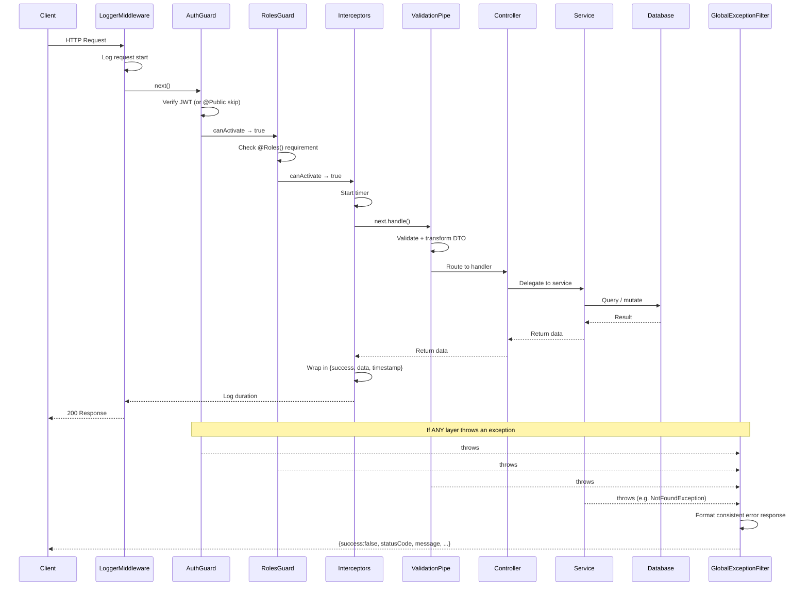

---

*Continued in the companion documents: Part IV (Database Layer), Part V (Validation Deep Dive), Part VI (Authentication & RBAC), and the Appendices.*
